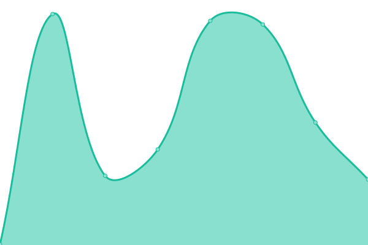
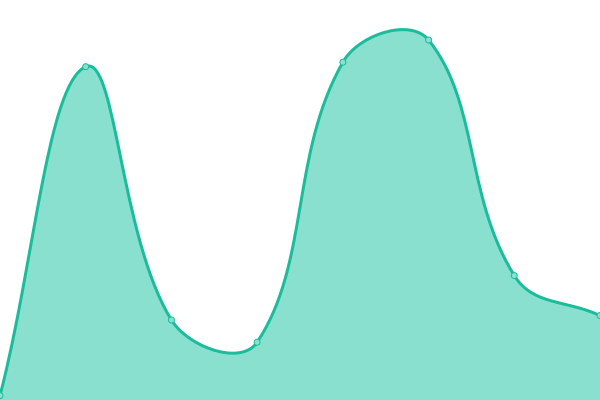
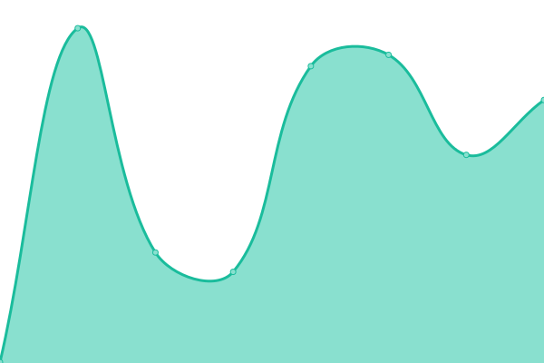
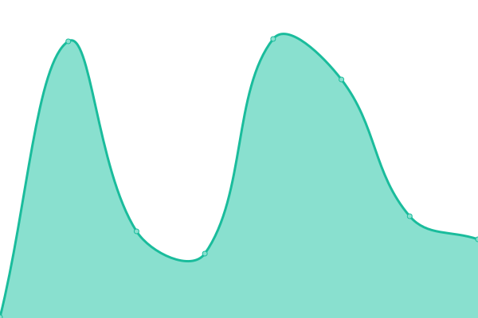
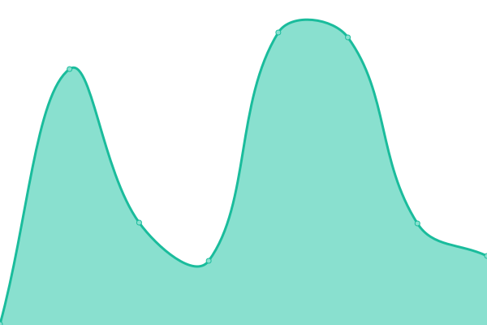
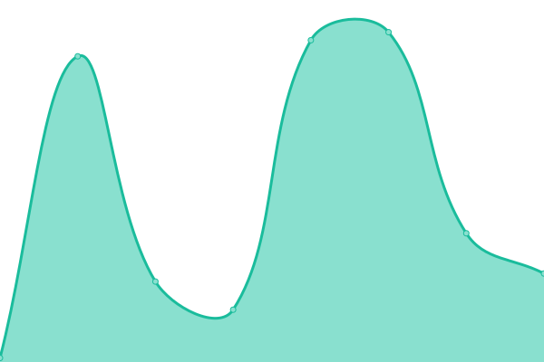

# [📈 Live Status](https://status.agorapp.dev): <!--live status--> **🟩 All systems operational**

This repository contains the open-source uptime monitor and status page for [Jakub Boukal](suki.wtf), powered by [Upptime](https://github.com/upptime/upptime).

With [Upptime](https://upptime.js.org), you can get your own unlimited and free uptime monitor and status page, powered entirely by a GitHub repository. We use [Issues](https://github.com/SukiCZ/agorapp-upptime/issues) as incident reports, [Actions](https://github.com/SukiCZ/agorapp-upptime/actions) as uptime monitors, and [Pages](https://status.agorapp.dev) for the status page.

<!--start: status pages-->
<!-- This summary is generated by Upptime (https://github.com/upptime/upptime) -->
<!-- Do not edit this manually, your changes will be overwritten -->
<!-- prettier-ignore -->
| URL | Status | History | Response Time | Uptime |
| --- | ------ | ------- | ------------- | ------ |
|  [AgorApp Production Frontend](https://agorapp.dev) | 🟩 Up | [agor-app-production-frontend.yml](https://github.com/SukiCZ/agorapp-uptime/commits/HEAD/history/agor-app-production-frontend.yml) | 

 246ms
     
 | 

<a href="https://SukiCZ.github.io/agorapp-uptime/history/agor-app-production-frontend">100.00%</a>
    

|  [AgorApp Production Backend](https://agorapp.dev/api/users/hello/) | 🟩 Up | [agor-app-production-backend.yml](https://github.com/SukiCZ/agorapp-uptime/commits/HEAD/history/agor-app-production-backend.yml) | 

 46ms
     
 | 

<a href="https://SukiCZ.github.io/agorapp-uptime/history/agor-app-production-backend">100.00%</a>
    

|  [AgorApp Motoko](https://motoko.agorapp.dev/course/motoko/motoko-tutorial/introduction) | 🟩 Up | [agor-app-motoko.yml](https://github.com/SukiCZ/agorapp-uptime/commits/HEAD/history/agor-app-motoko.yml) | 

 288ms
     
 | 

<a href="https://SukiCZ.github.io/agorapp-uptime/history/agor-app-motoko">100.00%</a>
    

|  [AgorApp Blog](https://blog.agorapp.dev) | 🟩 Up | [agor-app-blog.yml](https://github.com/SukiCZ/agorapp-uptime/commits/HEAD/history/agor-app-blog.yml) | 

 232ms
     
 | 

<a href="https://SukiCZ.github.io/agorapp-uptime/history/agor-app-blog">100.00%</a>
    

|  [AgorApp Staging Frontend](https://staging.agorapp.dev) | 🟩 Up | [agor-app-staging-frontend.yml](https://github.com/SukiCZ/agorapp-uptime/commits/HEAD/history/agor-app-staging-frontend.yml) | 

 190ms
     
 | 

<a href="https://SukiCZ.github.io/agorapp-uptime/history/agor-app-staging-frontend">100.00%</a>
    

|  [AgorApp Staging Backend](https://staging.agorapp.dev/api/users/hello/) | 🟩 Up | [agor-app-staging-backend.yml](https://github.com/SukiCZ/agorapp-uptime/commits/HEAD/history/agor-app-staging-backend.yml) | 

 46ms
     
 | 

<a href="https://SukiCZ.github.io/agorapp-uptime/history/agor-app-staging-backend">100.00%</a>
    

<!--end: status pages-->

[**Visit our status website →**](https://status.agorapp.dev)

## 📄 License

- Powered by: [Upptime](https://github.com/upptime/upptime)
- Code: [MIT](./LICENSE) © [Anand Chowdhary](https://anandchowdhary.com), supported by [Pabio](https://pabio.com)
- Data in the `./history` directory: [Open Database License](https://opendatacommons.org/licenses/odbl/1-0/)
